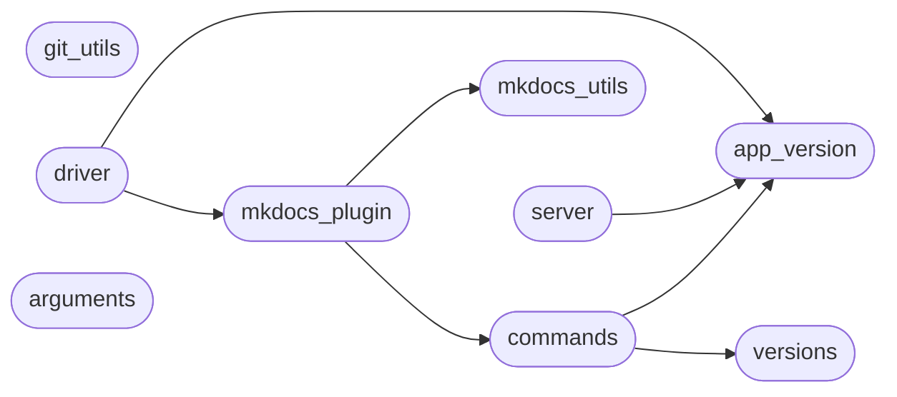

# Code Overview

[_Documentation generated by Documatic_](https://www.documatic.com)

<!---Documatic-section-Codebase Structure Python-start--->
## Codebase Structure Python

The codebase has a 2-deep folder structure,
                with 14 code files in total.

<!---Documatic-block-system_architecture-start--->

<!---Documatic-block-system_architecture-end--->

# #
<!---Documatic-section-Codebase Structure Python-end--->

<!---Documatic-section-Key Infrastructure-start--->
## Key Infrastructure

### MongoDB is used in:

* `remove` of `mike.versions.Versions`
* `update` of `mike.versions.Versions`

# #
<!---Documatic-section-Key Infrastructure-end--->

<!---Documatic-section-Important Functions-start--->
## Important Functions

<!---Documatic-block-important_funcs-start--->
<!---Documatic-block-most_used_funcs-start--->
### Most Utilised Functions

* mike.app_version.version (3 times)
* mike.mkdocs_utils.docs_version_var (1 times)
<!---Documatic-block-most_used_funcs-end--->
<!---Documatic-block-important_funcs-end--->

# #
<!---Documatic-section-Important Functions-end--->

<!---Documatic-section-File IO-start--->
## File IO

<!---Documatic-block-file_io-start--->
The following files have file read operations

<!---Documatic-block-mike-start--->

	
<code>mike</code> (Click to Expand!)

* mike.commands
* mike.git_utils
* mike.mkdocs_utils

<!---Documatic-block-mike-end--->
<!---Documatic-block-file_io-end--->

# #
<!---Documatic-section-File IO-end--->

<!---Documatic-section-Class Hierarchy-start--->
## Class Hierarchy

<!---Documatic-block-BaseHTTPRequestHandler-start--->

	
<code>BaseHTTPRequestHandler</code> (Click to Expand!)

* mike.server.GitBranchHTTPHandler

<!---Documatic-block-BaseHTTPRequestHandler-end--->

<!---Documatic-block-BasePlugin-start--->

	
<code>BasePlugin</code> (Click to Expand!)

* mike.mkdocs_plugin.MikePlugin

<!---Documatic-block-BasePlugin-end--->

<!---Documatic-block-Exception-start--->

	
<code>Exception</code> (Click to Expand!)

* mike.git_utils.GitError

<!---Documatic-block-Exception-end--->

<!---Documatic-block-_Action-start--->

	
<code>_Action</code> (Click to Expand!)

* mike.arguments.Action

<!---Documatic-block-_Action-end--->

<!---Documatic-block-_ArgumentParser-start--->

	
<code>_ArgumentParser</code> (Click to Expand!)

* mike.arguments.ArgumentParser

<!---Documatic-block-_ArgumentParser-end--->

<!---Documatic-block-mike.git_utils.GitError-start--->

	
<code>mike.git_utils.GitError</code> (Click to Expand!)

* mike.git_utils.GitBranchDiverged
* mike.git_utils.GitCommitError
* mike.git_utils.GitRevUnrelated

<!---Documatic-block-mike.git_utils.GitError-end--->

# #
<!---Documatic-section-Class Hierarchy-end--->

[_Documentation generated by Documatic_](https://www.documatic.com)